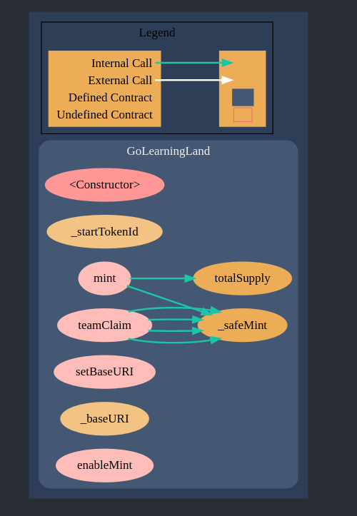

# NFTContract
Solidity Ethereum Contract for GLL

 Sūrya's Description Report

 Files Description Table

|  File Name  |  SHA-1 Hash  |
|-------------|--------------|
| /home/erdem/Desktop/NFTContract/golearningland.sol | 08db4d484f0fb550a7ff384083a465cac6767a8f |

 Contracts Description Table

|  Contract  |         Type        |       Bases      |                  |                 |
|:----------:|:-------------------:|:----------------:|:----------------:|:---------------:|
|     └      |  **Function Name**  |  **Visibility**  |  **Mutability**  |  **Modifiers**  |
||||||
| **GoLearningLand** | Implementation | ERC721A, Ownable |||
| └ | <Constructor> | Public ❗️ | 🛑  | ERC721A |
| └ | _startTokenId | Internal 🔒 |   | |
| └ | mint | External ❗️ | 🛑  |NO❗️ |
| └ | teamClaim | External ❗️ | 🛑  | onlyOwner |
| └ | setBaseURI | External ❗️ | 🛑  | onlyOwner |
| └ | _baseURI | Internal 🔒 |   | |
| └ | enableMint | External ❗️ | 🛑  | onlyOwner |

 Legend

|  Symbol  |  Meaning  |
|:--------:|-----------|
|    🛑    | Function can modify state |
|    💵    | Function is payable |

